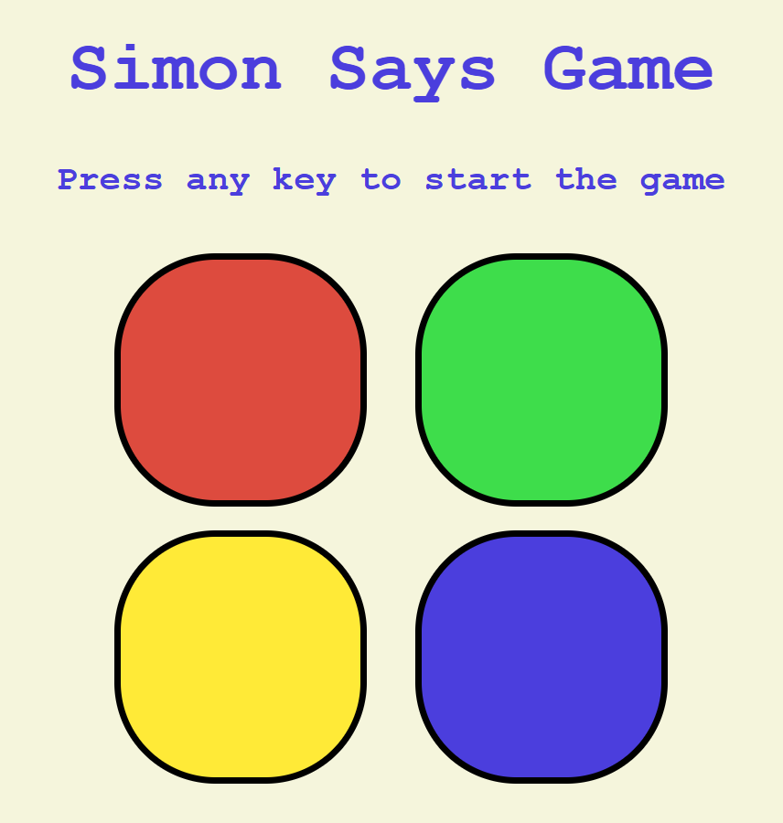

# ???? Simon Says Game

A traditional memory game remade with **HTML**, **CSS**, and **JavaScript**. Challenge your memory by repeating the color sequence accurately — every level increases one to the pattern!

---

## ???? About the Game

**Simon Says** is an entertaining and difficult memory game in which one player has to repeat a continually longer sequence of lights and beeps. One begins at level 1, and each correct repetition adds another to the sequence.

---

## ???? Features

- ???? Smooth, colorful UI with nice animations
- ???? A sound effect per button press
- ⏫ Level system and game over notification
- ???? Progressive difficulty to test your memory
- ???? Mobile and desktop responsive design

---

## ???? Demo

You can play it live too [here](#) (Add your GitHub Pages or deployment link)

---

## ????️ Tech Stack

- **HTML** – Game structure
- **CSS** – Styling and positioning
- **JavaScript** – Game logic and responsiveness

---

## ???? How to Play

1. Click the **Start** button to start the game.
2. Observe the series of colors that illuminate.
3. Click the colored buttons in the same sequence.
4. For every level, the sequence will be one more.
5. If you click the wrong button, the game is over and you have to restart.

---

## ???? Project Structure
